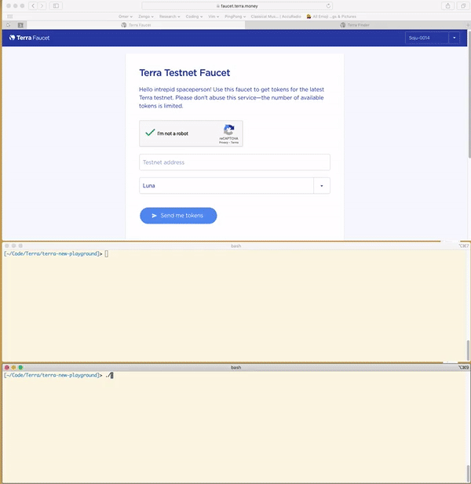

# Terra Threshold Wallet

Terra wallet powered by two-party ECDSA.

**WIP!! Use at your own risk**

## Installation

1. Install [Node.js](https://nodejs.org/en/download/)<br>
   (tested on Node 10)
2. Install [nightly Rust](https://github.com/rust-lang/rustup.rs#installation)<br>
   (tested on rustc 1.38.0-nightly (0b680cfce 2019-07-09))
3. Install the package:

```sh
git clone https://github.com/KZen-networks/terra-new-playground.git
cd terra-new-playground
yarn install
yarn build
```

Built files will be located in the `dist` folder.

## Running the Code

You can run a demo using the command line.  
Server:

```sh
$ demo/server
```

Client:

```sh
Usage: client [options] [command]
```

- Start by generating a new address.
- Populate the address with coins from testnet [faucet](https://faucet.terra.money)

### Commands:

##### Print an existing address or generate a new one

```
  address [options]
```

Example

```
./demo/lient address --index 1
```

##### Print balance of address

```
balance [options] <address>
```

Example

```
./demo/lient balance terra1efhd0j476zznhq4c2czjyfnyufjxt8rc7fqxpj
```

##### Trasnfer an \<amount\> of [denom] from address \<from\> to address \<to\>

- Add `--dry_run` to generate the trnasaction without executing
- Add `--all` to send all currency in specified denom

```
transfer [options] <from> <to> <amount>
```

Example

```
./demo/client transfer terra1xpjtwmemdwz053q4jxjx0ht4dtp25rc799deyf terra1qrkvv8dwc946cltuuqkd09r6yh0z3a30x3umxx 1000 --denom uusd --all --dry_run
```

##### Get info on transaction hash

```
tx_info [options] <txhash>
```

Example

```
./demo/client tx_info A84D7AEFD5D3CC6906A80BA6D67E6DC1098345CF094B2A61648DD553117D03B6
```

##### Get all transactions for a specifed account

```
transactions [options]
```

Example

```
./demo/client transactions --account terra1xpjtwmemdwz053q4jxjx0ht4dtp25rc799deyf
```

### Advanced functionality 

##### Get exchange rates of tokens to others

```
 rates [options]
```

Example

```
./demo/client rates --denom uusd
```

##### Swap \<amount\> of a token [denom] from address \<from\> for another token \<ask\>

```
  swap [options] <from> <amount> <ask>
```

Example

```
./demo/client swap terra1xpjtwmemdwz053q4jxjx0ht4dtp25rc799deyf 1000 --denom uluna uusd
```

## Testing

Note: _The server must be online for tests to work_

1. Generate addresses 4 addresses for testing
2. Populate 1 address with LUNA, UST, KRT from faucet (used as bank for testing sends)
3. Populate 1 address with UST only (used for testing Terra without LUNA)
4. Replace addresses according to comments in `test/test.js`
5. Run `yarn test`

- You can generate a new address using the same share, but specifying the index

Exmpale:

```sh
./demo/client address --index 1
```

## Running a full terra node (Optional)

Documentation available [here](https://docs.terra.money/node/installation.html)

### Build terra and copy the necessary:

- Copy the genesis file for the correct network from testnet's [repo](https://github.com/terra-project/testnet) to `~/.terrad/config`

- Create a new config file

```
terrad init --chain-id=soju-0014
```

- Replace line for persistent peers in `~/.terrad/config/config.toml`

```
persistent_peers = "1e1677e4ed9acf4e28de40b67ac01554aed1a29e@52.78.69.160:26656"
```

Peer information is available in testnet' [repo](https://github.com/terra-project/testnet) to `~/.terrad/config`

### Run a terra node

Start a node

```
terrad start
```

Optionally, run a terra rest-server in another terminal

```
terracli rest-server --chain-id=soju-0014     --laddr=tcp://0.0.0.0:1317     --node tcp://localhost:26657     --trust-node=false
```

## Demo


## License

GPL-3.0
